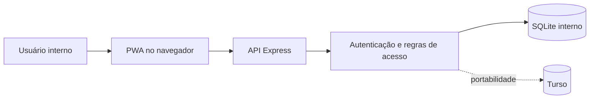
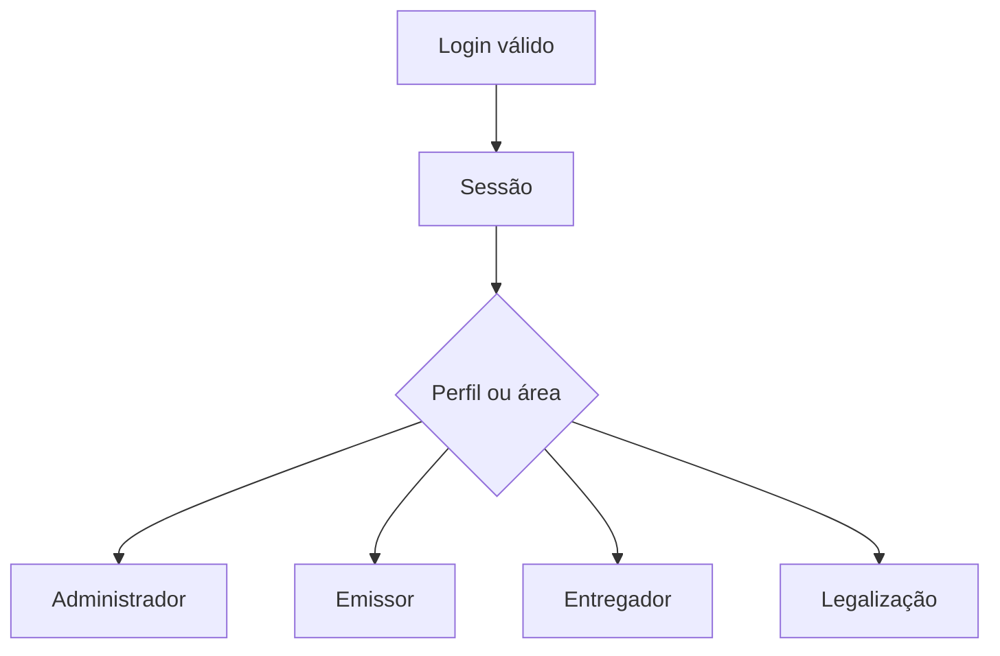

# Arquitetura

## Visão geral

O Hiperion Protocolos é um monólito modular em Node.js. A interface PWA é compartilhada pelos dois modos de execução; a diferença principal está no adaptador de persistência.

O caminho SQLite representa a operação principal. O caminho Turso permite hospedar o mesmo produto em ambiente web quando houver essa necessidade.

## Componentes

| Componente | Responsabilidade |
| --- | --- |
| `public/index.html` | interface, formulários, painéis e impressão |
| `public/offline.js` | suporte offline e sincronização dos fluxos compatíveis |
| `public/service-worker.js` | cache dos recursos da PWA |
| `server.js` | API do ambiente interno |
| `banco/db.js` | criação, evolução e acesso ao SQLite |
| `server-turso.js` | API do ambiente web portável |
| `vercel.json` | roteamento da implantação na Vercel |

## Autorização

A interface adapta o que apresenta para cada perfil, mas a API é a autoridade. Ocultar botões não substitui a verificação no servidor.

## Persistência

O SQLite é adequado ao servidor interno por reduzir infraestrutura e manter os dados próximos da operação. Deve existir um único processo gravador por arquivo, armazenado em disco local persistente.

O Turso atende ao modelo serverless da Vercel. Ele depende de conectividade e credenciais externas, por isso é tratado como opção de portabilidade.

As duas implementações ainda mantêm parte das rotas em arquivos separados. Mudanças de negócio precisam ser aplicadas e validadas nos dois servidores.

## Limites da edição pública

O repositório público demonstra a arquitetura e os fluxos centrais, mas não contém dados, configuração operacional, histórico real nem segredos da instalação privada.
