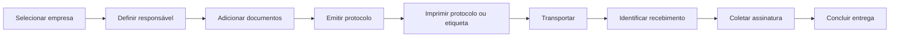

# Fluxos e permissões

## Perfis

| Perfil ou área | Responsabilidade principal |
| --- | --- |
| Administrador | usuários, configurações e visão administrativa |
| Emissor | criação e acompanhamento de protocolos |
| Entregador | transporte e confirmação das entregas atribuídas |
| Legalização | emissão e manutenção do cadastro de empresas |

Uma pessoa pode possuir mais de uma responsabilidade operacional, mas deve usar o perfil adequado à tarefa. As permissões são verificadas no servidor.

## Emissão e entrega

O protocolo preserva o emissor, o entregador atribuído, os documentos e a confirmação final.

## Cancelamento e exclusão

- cancelamento interrompe um protocolo sem apagar seu histórico;
- exclusão recuperável remove o registro das telas operacionais;
- restauração devolve o registro ao fluxo;
- operações administrativas permanecem restritas ao perfil autorizado.

## Operação offline

A PWA armazena somente as ações explicitamente suportadas quando a conexão cai e tenta sincronizá-las quando o servidor retorna. A API volta a validar sessão, permissão e estado atual; a fila local não é autoridade sobre o dado.
